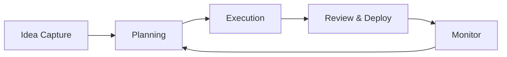

## Overview

StackStudio provides a unified pipeline that streamlines your planning and development processes. You gain a single interface to manage ideas from inception to execution, eliminating silos and reducing complexity. Core concepts include the pipeline architecture, distinct planning and execution stages, friction reduction mechanisms, and built-in collaboration tools for inclusive teams.

## Unified Pipeline Architecture

The unified pipeline connects all stages of development in a linear yet flexible flow. You configure it once and reuse it across projects, ensuring consistency.



<Columns cols={3}>
  <Card title="Modular Stages" icon="settings">
    Customize each stage with plugins for your workflow.
  </Card>
  <Card title="Real-time Sync" icon="zap">
    Changes propagate instantly across team members.
  </Card>
  <Card title="Scalable" icon="trending-up">
    Handles projects from solo ideas to enterprise-scale.
  </Card>
</Columns>

## Planning and Execution Stages

StackStudio divides workflows into clear stages. Use the planning stage to outline requirements and the execution stage to build and test.

<Tabs>
  <Tab title="Planning" icon="book-open">
    <Steps>
      <Step title="Capture Ideas" icon="lightbulb">
        Log ideas with rich metadata.
      </Step>
      <Step title="Assign Resources" icon="users">
        Allocate team members and timelines.
      </Step>
      <Step title="Review Milestones" icon="check-circle">
        Validate plans before execution.
      </Step>
    </Steps>
  </Tab>
  <Tab title="Execution" icon="play-circle">
    <Steps>
      <Step title="Build Features" icon="code">
        Implement using integrated tools.
      </Step>
      <Step title="Test Iteratively" icon="bug">
        Run automated tests in the pipeline.
      </Step>
      <Step title="Deploy Safely" icon="rocket">
        Roll out with rollback options.
      </Step>
    </Steps>
  </Tab>
</Tabs>

## Reducing Process Friction

StackStudio minimizes handoffs by automating transitions between stages. You avoid context-switching with a single dashboard view.

<Callout kind="tip">
  Integrate your existing tools via webhooks to `https://api.example.com/webhooks` for seamless data flow.
</Callout>

Here is a simple integration example:

<CodeGroup tabs="JavaScript,Python">
  ```javascript
  const response = await fetch('https://api.example.com/pipeline/transition', {
    method: 'POST',
    headers: { 'Authorization': 'Bearer YOUR_TOKEN' },
    body: JSON.stringify({ stage: 'planning-to-execution', projectId: 'proj_123' })
  });
  ```
  ```python
  import requests
  response = requests.post(
      'https://api.example.com/pipeline/transition',
      headers={'Authorization': 'Bearer YOUR_TOKEN'},
      json={'stage': 'planning-to-execution', 'projectId': 'proj_123'}
  )
  ```
</CodeGroup>

## Collaboration and Inclusivity Features

Enable every team member to contribute regardless of role or expertise. Features include role-based access, real-time comments, and AI-assisted suggestions.

<ExpandableGroup>
  <Expandable title="Role-Based Permissions" default-open="true">
    Assign permissions like `viewer`, `editor`, or `admin` to ensure secure collaboration. Use the API to manage:

    <ParamField path="projectId" param-type="string" required="true">
      Your project identifier.
    </ParamField>

    <ParamField header="Authorization" param-type="string" required="true">
      Bearer token for auth.
    </ParamField>
  </Expandable>
  <Expandable title="Real-time Comments">
    Add threaded discussions on any pipeline stage. Notifications keep everyone aligned.
  </Expandable>
  <Expandable title="AI Suggestions">
    Get automated insights on bottlenecks and optimizations.
  </Expandable>
</ExpandableGroup>

<Callout kind="success">
  Start with a new pipeline today to experience reduced friction firsthand.
</Callout>