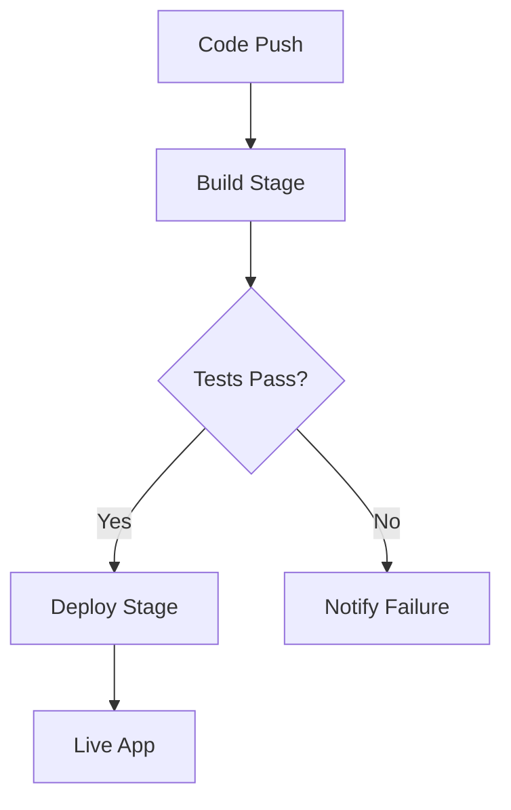

## Prerequisites

Before you begin, ensure you have the following:

<Callout kind="info">
- A modern web browser (Chrome, Firefox, or Safari)
- An email address for account verification
- Optional: Your `{API_KEY}` from a previous integration (generate one later if needed)
</Callout>

## Create Your Account

Follow these steps to sign up for StackStudio.

<Steps>
  <Step title="Visit the Dashboard" icon="monitor">
    Navigate to `https://dashboard.example.com` and click **Sign Up**.
  </Step>
  <Step title="Enter Your Details" icon="user">
    Provide your email, create a strong password, and complete the CAPTCHA.
  </Step>
  <Step title="Verify Email" icon="mail">
    Check your inbox for the verification link from StackStudio and click it to activate your account.
  </Step>
</Steps>

## Log In and Explore the Dashboard

Once logged in at `https://dashboard.example.com/login`, you land on the main dashboard.

<Tabs>
  <Tab title="Projects Overview" icon="layout">
    View your active projects, pipeline status, and recent activity. Use the search bar to filter by name or status.
  </Tab>
  <Tab title="Pipelines" icon="git-branch">
    Access pre-built templates for CI/CD, deployment, and testing pipelines. Customize them to fit your stack.
  </Tab>
  <Tab title="Integrations" icon="plug">
    Connect GitHub, AWS, or Docker repositories. Start with the **Quick Connect** button for GitHub.
  </Tab>
</Tabs>

## Create Your First Project

Launch your initial project in under 2 minutes.

<Steps>
  <Step title="New Project" icon="plus">
    Click **New Project** in the top-right corner.
  </Step>
  <Step title="Configure Basics" icon="settings">
    Enter project name (e.g., `my-first-app`), select language (`Node.js`), and add a Git repo URL like `https://github.com/yourusername/my-first-app`.
  </Step>
  <Step title="Save and Deploy" icon="rocket">
    Review settings and click **Create**. Monitor the initial build in the activity feed.
  </Step>
</Steps>

## Set Up Your Initial Pipeline

Define a basic pipeline using the visual editor or configuration file.

<CodeGroup tabs="YAML,JSON">
  ```yaml
  version: '1.0'
  stages:
    - name: build
      tasks:
        - run: npm install
        - run: npm test
    - name: deploy
      tasks:
        - run: npm run build
        - deploy: aws-s3
  ```
  ```json
  {
    "version": "1.0",
    "stages": [
      {
        "name": "build",
        "tasks": [
          {"run": "npm install"},
          {"run": "npm test"}
        ]
      },
      {
        "name": "deploy",
        "tasks": [
          {"run": "npm run build"},
          {"deploy": "aws-s3"}
        ]
      }
    ]
  }
  ```
</CodeGroup>

<Callout kind="tip">
Upload this config via the dashboard's **Pipeline Editor** or push it to your repo's `.stackstudio.yml` file. Test the pipeline with the **Run Now** button.
</Callout>



## Next Steps

Explore more features to supercharge your workflow.

<Columns cols={3}>
  <Card title="Authentication" icon="lock" href="/authentication">
    Secure your projects with API keys and OAuth.
  </Card>
  <Card title="Advanced Pipelines" icon="git-branch" href="/configuration">
    Customize complex multi-stage deployments.
  </Card>
  <Card title="Integrations" icon="plug" href="/introduction">
    Connect your full tech stack seamlessly.
  </Card>
</Columns>